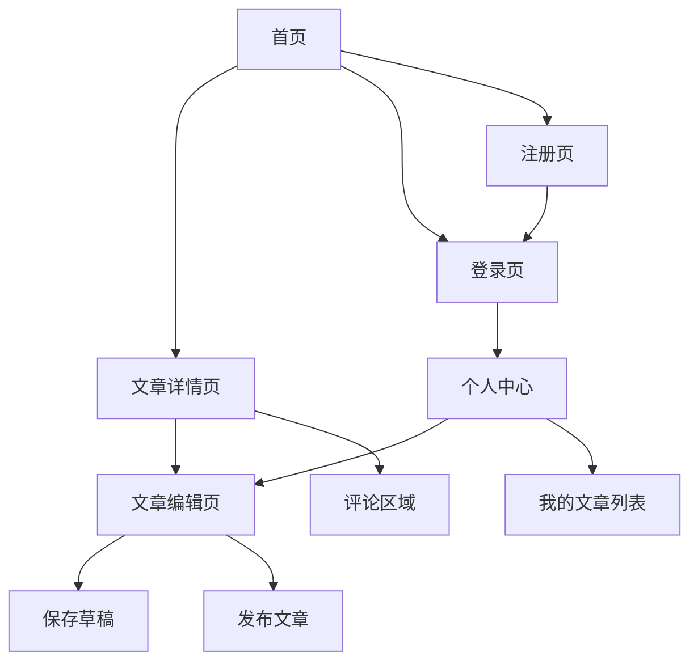

# 全栈博客应用 - 产品需求文档

## 1. 产品概述

本博客应用是一个前后端分离的全栈内容管理平台，为用户提供简洁高效的文章创作和阅读体验。

目标用户：个人博主、技术写作者、内容创作者。

## 2. 核心功能

### 2.1 用户角色

| 角色 | 注册方式 | 核心权限 |
|------|----------|----------|
| 访客 | 无需注册 | 浏览文章、查看评论 |
| 注册用户 | 邮箱/用户名注册 | 发布评论、点赞文章 |
| 管理员 | 后台配置 | 文章发布/编辑/删除、评论管理 |

### 2.2 功能模块

本博客应用包含以下主要页面：

1. **首页**：文章列表展示、分类导航、搜索功能、热门文章推荐。
2. **文章详情页**：文章内容展示、评论列表、评论发布、文章分享。
3. **文章编辑页**：富文本编辑器、文章保存/发布、标签管理。
4. **登录/注册页**：用户登录、账号注册、密码找回。
5. **个人中心**：用户信息管理、我的文章列表、评论历史。

### 2.3 页面详情

| 页面名称 | 模块名称 | 功能描述 |
|----------|----------|----------|
| 首页 | 导航栏 | 包含Logo、搜索框、分类菜单、登录/注册入口。 |
| 首页 | 文章列表 | 展示文章卡片（标题、摘要、作者、发布时间、阅读量），支持分页加载。 |
| 首页 | 侧边栏 | 显示热门文章、文章分类、标签云。 |
| 首页 | 页脚 | 版权信息、友情链接、关于我们。 |
| 文章详情页 | 文章头部 | 显示文章标题、作者信息、发布时间、阅读量、所属分类。 |
| 文章详情页 | 文章内容 | 富文本渲染，支持代码高亮、图片展示。 |
| 文章详情页 | 文章操作 | 点赞、收藏、分享按钮。 |
| 文章详情页 | 评论区 | 评论列表展示（头像、用户名、评论内容、时间），支持回复嵌套。 |
| 文章详情页 | 评论输入 | 已登录用户可发表评论，支持富文本输入。 |
| 文章编辑页 | 编辑器 | Markdown/富文本双模式编辑器，支持实时预览。 |
| 文章编辑页 | 文章设置 | 设置标题、分类、标签、封面图、发布状态（草稿/已发布）。 |
| 文章编辑页 | 操作按钮 | 保存草稿、预览、发布文章。 |
| 登录/注册页 | 登录表单 | 用户名/邮箱 + 密码登录，记住密码选项。 |
| 登录/注册页 | 注册表单 | 用户名、邮箱、密码、确认密码，邮箱验证。 |
| 个人中心 | 用户信息 | 显示/编辑头像、昵称、个人简介。 |
| 个人中心 | 我的文章 | 管理已发布和草稿文章，支持编辑、删除。 |
| 个人中心 | 我的评论 | 查看历史评论记录。 |

## 3. 核心流程

### 3.1 访客浏览流程

访客访问首页 → 浏览文章列表 → 点击文章进入详情页 → 阅读文章内容 → 查看评论

### 3.2 用户注册登录流程

访客点击登录 → 输入账号密码 → 登录成功 → 跳转首页 → 可进行评论等操作

### 3.3 文章发布流程

管理员登录 → 进入文章编辑页 → 编写文章内容 → 设置分类标签 → 保存草稿/发布文章 → 文章展示在首页

### 3.4 评论流程

已登录用户进入文章详情页 → 查看评论列表 → 输入评论内容 → 提交评论 → 评论实时显示

### 3.5 页面导航流程图

## 4. 用户界面设计

### 4.1 设计风格

- **主色调**：蓝色系 (#1890ff) 作为主色，灰色 (#f0f2f5) 作为背景色
- **按钮样式**：圆角矩形，主要按钮使用主色调，次要按钮使用描边样式
- **字体**：系统默认字体栈，标题 24-32px，正文 14-16px
- **布局风格**：卡片式布局，顶部固定导航，内容区域居中，最大宽度 1200px
- **图标风格**：使用 Ant Design 图标库，线性风格

### 4.2 页面设计概述

| 页面名称 | 模块名称 | UI 元素 |
|----------|----------|---------|
| 首页 | 导航栏 | 固定顶部，高度 64px，白色背景，阴影效果 |
| 首页 | 文章列表 | 卡片式布局，每行 1-3 列，间距 24px，悬停阴影效果 |
| 首页 | 侧边栏 | 宽度 300px，固定位置，包含多个小部件模块 |
| 文章详情页 | 文章区域 | 白色背景卡片，内边距 40px，最大宽度 800px 居中 |
| 文章详情页 | 评论区 | 树形结构展示，支持嵌套回复，头像 + 用户名 + 时间 + 内容 |
| 文章编辑页 | 编辑器 | 左右分栏，左侧编辑区，右侧预览区，比例 1:1 |
| 登录/注册页 | 表单 | 居中卡片，宽度 400px，圆角 8px，阴影效果 |
| 个人中心 | 信息卡片 | 顶部展示用户信息，下方 Tab 切换不同功能模块 |

### 4.3 响应式设计

- **桌面端优先**：默认设计为桌面端 (≥1200px)
- **平板适配**：适配 768px-1199px，文章列表改为 2 列
- **移动端适配**：适配 <768px，文章列表改为 1 列，侧边栏收起为抽屉
- **触摸优化**：移动端按钮尺寸不小于 44px，支持手势滑动

### 4.4 交互设计

- **加载状态**：骨架屏加载，按钮加载动画
- **反馈提示**：操作成功/失败使用 Toast 提示
- **过渡动画**：页面切换使用淡入淡出，卡片悬停使用阴影和位移效果
- **无限滚动**：文章列表支持滚动加载更多
