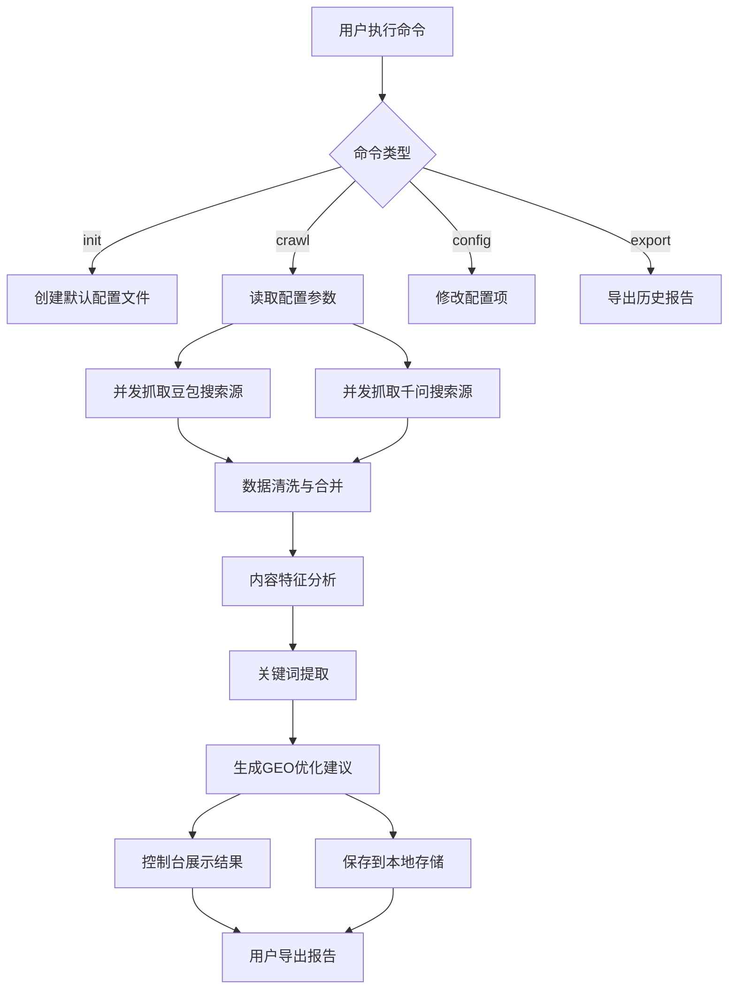

# 搜索源抓取与GEO优化Agent - 产品需求文档

## 1. 产品概述

一个基于Node.js的命令行Agent工具，自动抓取豆包(Doubao)和千问(Qianwen)的搜索源数据，并基于抓取内容进行GEO(生成引擎优化)分析，输出结构化的优化建议报告。

目标用户：内容创作者、SEO优化师、数字营销人员，帮助他们了解AI搜索引擎的内容引用偏好，优化内容以提升在AI搜索中的曝光度。

## 2. 核心功能

### 2.1 用户角色

| 角色 | 使用方式 | 核心权限 |
|------|----------|----------|
| CLI用户 | 命令行执行 | 配置抓取参数、执行抓取任务、导出分析报告 |

### 2.2 功能模块

本Agent工具包含以下核心模块：

1. **配置管理模块**：初始化配置、参数设置、配置文件管理
2. **搜索源抓取模块**：豆包搜索源抓取、千问搜索源抓取、数据清洗与存储
3. **GEO分析模块**：内容特征分析、关键词提取、结构优化建议生成
4. **报告输出模块**：控制台展示、文件导出（JSON/CSV/Markdown）

### 2.3 功能详情

| 模块名称 | 功能名称 | 功能描述 |
|----------|----------|----------|
| 配置管理 | 初始化配置 | 创建默认配置文件，设置API密钥、抓取参数、输出路径等 |
| 配置管理 | 参数配置 | 支持配置抓取深度、并发数、超时时间、代理设置等 |
| 配置管理 | 配置验证 | 验证配置文件的完整性和有效性 |
| 搜索源抓取 | 豆包搜索源抓取 | 模拟搜索请求，抓取豆包返回的引用源URL、标题、摘要等信息 |
| 搜索源抓取 | 千问搜索源抓取 | 模拟搜索请求，抓取千问返回的引用源URL、标题、摘要等信息 |
| 搜索源抓取 | 数据清洗 | 过滤无效数据，标准化字段格式，去重处理 |
| 搜索源抓取 | 数据存储 | 将抓取结果保存到本地JSON文件或内存中 |
| GEO分析 | 内容特征分析 | 分析抓取结果中的内容长度、结构、关键词密度等特征 |
| GEO分析 | 关键词提取 | 提取高频关键词、长尾词、语义相关词 |
| GEO分析 | 优化建议生成 | 基于分析结果生成GEO优化建议，包括标题优化、结构调整、关键词布局等 |
| 报告输出 | 控制台展示 | 在终端以表格形式展示分析结果和优化建议 |
| 报告输出 | JSON导出 | 导出结构化JSON格式的完整分析报告 |
| 报告输出 | CSV导出 | 导出CSV格式的数据表格，便于Excel分析 |
| 报告输出 | Markdown导出 | 导出Markdown格式的可读报告文档 |

## 3. 核心流程

### 3.1 用户使用流程

1. **初始化配置**：用户首次使用执行 `search-agent init` 命令，创建配置文件
2. **配置参数**：编辑配置文件，设置搜索关键词、抓取参数等
3. **执行抓取**：运行 `search-agent crawl` 命令，Agent自动抓取豆包和千问的搜索源
4. **GEO分析**：抓取完成后，Agent自动进行内容分析和GEO优化建议生成
5. **查看报告**：在控制台查看分析结果，或导出为文件进行进一步处理

### 3.2 系统处理流程

## 4. 用户界面设计

### 4.1 设计风格

- **界面类型**：命令行终端界面(CLI)
- **主色调**：终端默认配色，关键信息使用高亮颜色
  - 成功信息：绿色
  - 警告信息：黄色
  - 错误信息：红色
  - 关键数据：青色/蓝色
- **字体**：等宽字体(Monospace)，确保表格对齐
- **布局风格**：
  - 使用ASCII艺术展示Logo和分隔线
  - 表格形式展示结构化数据
  - 进度条展示长时间任务进度
  - 折叠/展开形式展示详细信息

### 4.2 交互元素

| 界面场景 | 元素类型 | 设计说明 |
|----------|----------|----------|
| 启动界面 | ASCII Logo + 版本信息 | 展示工具名称、版本、使用提示 |
| 命令提示 | 彩色命令列表 | 高亮显示可用命令和参数 |
| 抓取进度 | 动态进度条 | 显示当前抓取进度、已抓取数量、预计剩余时间 |
| 结果展示 | 表格 | 使用cli-table3展示结构化数据，支持列对齐 |
| 详细报告 | 折叠面板 | 使用交互式折叠展示详细分析内容 |
| 导出确认 | 确认提示 | 使用inquirer.js实现交互式确认 |

### 4.3 响应式设计

- **终端适配**：自动检测终端宽度，调整表格列宽
- **颜色模式**：支持亮色/暗色终端主题自动适配
- **进度反馈**：长时间任务提供实时进度更新，支持Ctrl+C优雅退出

## 5. 错误处理策略

### 5.1 错误分类

| 错误类型 | 处理策略 |
|----------|----------|
| 配置错误 | 提示具体配置项错误，提供修复建议 |
| 网络错误 | 自动重试3次，失败后记录错误并跳过当前任务 |
| 抓取限制 | 检测到频率限制时自动降速，使用退避策略 |
| 数据解析错误 | 记录原始数据，跳过当前条目，继续处理其他数据 |
| 存储错误 | 提示用户检查磁盘空间，提供备用存储路径选项 |

### 5.2 日志记录

- 所有操作记录到日志文件 `logs/search-agent.log`
- 支持 `--verbose` 参数输出详细调试信息
- 错误日志单独记录到 `logs/error.log`
