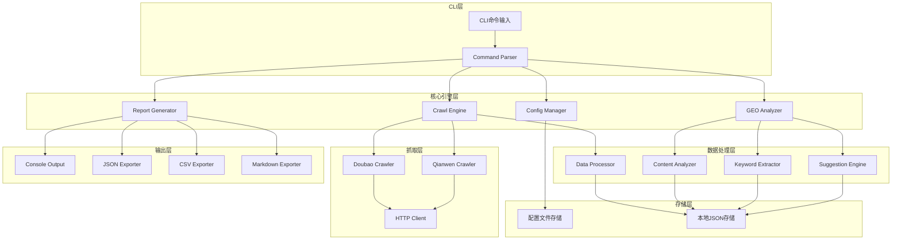
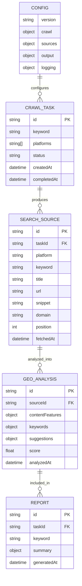

# 搜索源抓取与GEO优化Agent - 技术架构文档

## 1. 架构设计



## 2. 技术描述

- **运行时**: Node.js@18+
- **语言**: TypeScript@5
- **初始化工具**: npm init + tsc --init
- **核心依赖**:
  - `commander`: 命令行参数解析
  - `axios`: HTTP请求
  - `cheerio`: HTML解析
  - `cli-table3`: 终端表格展示
  - `ora`: 终端加载动画
  - `chalk`: 终端颜色输出
  - `inquirer`: 交互式命令行提示
  - `natural`: 自然语言处理（关键词提取）
  - `fs-extra`: 增强文件操作
  - `winston`: 日志记录
- **开发依赖**:
  - `typescript`: TypeScript编译器
  - `@types/node`: Node.js类型定义
  - `ts-node`: TypeScript直接运行
  - `nodemon`: 开发热重载
  - `eslint`: 代码检查
  - `prettier`: 代码格式化

## 3. 命令定义

| 命令 | 参数 | 用途 |
|------|------|------|
| `search-agent init` | `--config-path <path>` | 初始化配置文件 |
| `search-agent crawl` | `--keyword <keyword>`, `--source <doubao\|qianwen\|all>`, `--output <path>` | 执行搜索源抓取 |
| `search-agent config` | `--get <key>`, `--set <key> <value>`, `--list` | 配置管理 |
| `search-agent analyze` | `--input <path>`, `--output <path>` | 对已有数据进行GEO分析 |
| `search-agent export` | `--format <json\|csv\|md>`, `--input <path>`, `--output <path>` | 导出分析报告 |
| `search-agent history` | `--limit <n>`, `--clear` | 查看/清理历史记录 |

## 4. 模块设计

### 4.1 核心类型定义

```typescript
// 配置类型
interface Config {
  version: string;
  crawl: {
    concurrent: number;
    timeout: number;
    retryCount: number;
    userAgent: string;
    proxy?: string;
    delay: number;
  };
  sources: {
    doubao: {
      enabled: boolean;
      baseUrl: string;
    };
    qianwen: {
      enabled: boolean;
      baseUrl: string;
    };
  };
  output: {
    defaultPath: string;
    formats: ('json' | 'csv' | 'markdown')[];
  };
  logging: {
    level: 'debug' | 'info' | 'warn' | 'error';
    file: string;
  };
}

// 搜索源数据类型
interface SearchSource {
  id: string;
  platform: 'doubao' | 'qianwen';
  keyword: string;
  title: string;
  url: string;
  snippet: string;
  domain: string;
  position: number;
  fetchedAt: Date;
}

// GEO分析结果类型
interface GEOAnalysis {
  id: string;
  sourceId: string;
  contentFeatures: {
    wordCount: number;
    paragraphCount: number;
    avgSentenceLength: number;
    headingCount: number;
    listCount: number;
    linkCount: number;
    imageCount: number;
  };
  keywords: {
    primary: string[];
    secondary: string[];
    longTail: string[];
    density: Record<string, number>;
  };
  suggestions: {
    title: string[];
    structure: string[];
    content: string[];
    keywords: string[];
  };
  score: number;
  analyzedAt: Date;
}

// 报告类型
interface Report {
  id: string;
  keyword: string;
  sources: SearchSource[];
  analyses: GEOAnalysis[];
  summary: {
    totalSources: number;
    avgScore: number;
    topKeywords: string[];
    commonPatterns: string[];
  };
  generatedAt: Date;
}
```

### 4.2 类设计

```typescript
// 配置管理器
class ConfigManager {
  private configPath: string;
  private config: Config;
  
  constructor(configPath?: string);
  init(): Promise<void>;
  get(key: string): any;
  set(key: string, value: any): Promise<void>;
  validate(): boolean;
  getConfig(): Config;
}

// 抓取引擎
class CrawlEngine {
  private config: Config;
  private crawlers: Map<string, BaseCrawler>;
  
  constructor(config: Config);
  registerCrawler(name: string, crawler: BaseCrawler): void;
  crawl(keyword: string, sources?: string[]): Promise<SearchSource[]>;
}

// 基础抓取器
abstract class BaseCrawler {
  protected config: Config;
  protected httpClient: AxiosInstance;
  
  constructor(config: Config);
  abstract crawl(keyword: string): Promise<SearchSource[]>;
  abstract getName(): string;
  protected parseHTML(html: string): SearchSource[];
}

// 豆包抓取器
class DoubaoCrawler extends BaseCrawler {
  crawl(keyword: string): Promise<SearchSource[]>;
  getName(): string;
}

// 千问抓取器
class QianwenCrawler extends BaseCrawler {
  crawl(keyword: string): Promise<SearchSource[]>;
  getName(): string;
}

// 数据处理器
class DataProcessor {
  clean(sources: SearchSource[]): SearchSource[];
  deduplicate(sources: SearchSource[]): SearchSource[];
  normalize(sources: SearchSource[]): SearchSource[];
  save(sources: SearchSource[], path: string): Promise<void>;
  load(path: string): Promise<SearchSource[]>;
}

// GEO分析器
class GEOAnalyzer {
  private config: Config;
  
  constructor(config: Config);
  analyze(sources: SearchSource[]): Promise<GEOAnalysis[]>;
  private extractContentFeatures(content: string): ContentFeatures;
  private extractKeywords(content: string): Keywords;
  private generateSuggestions(features: ContentFeatures, keywords: Keywords): Suggestions;
  private calculateScore(analysis: GEOAnalysis): number;
}

// 报告生成器
class ReportGenerator {
  generateConsoleReport(report: Report): void;
  generateJSONReport(report: Report, path: string): Promise<void>;
  generateCSVReport(report: Report, path: string): Promise<void>;
  generateMarkdownReport(report: Report, path: string): Promise<void>;
}

// 日志记录器
class Logger {
  private logger: winston.Logger;
  
  debug(message: string, meta?: any): void;
  info(message: string, meta?: any): void;
  warn(message: string, meta?: any): void;
  error(message: string, meta?: any): void;
}
```

## 5. 数据模型

### 5.1 数据模型定义



### 5.2 数据定义

**配置文件 (config.json)**
```json
{
  "version": "1.0.0",
  "crawl": {
    "concurrent": 3,
    "timeout": 30000,
    "retryCount": 3,
    "userAgent": "Mozilla/5.0 (Windows NT 10.0; Win64; x64) AppleWebKit/537.36",
    "delay": 1000
  },
  "sources": {
    "doubao": {
      "enabled": true,
      "baseUrl": "https://www.doubao.com"
    },
    "qianwen": {
      "enabled": true,
      "baseUrl": "https://qianwen.aliyun.com"
    }
  },
  "output": {
    "defaultPath": "./output",
    "formats": ["json", "csv", "markdown"]
  },
  "logging": {
    "level": "info",
    "file": "./logs/search-agent.log"
  }
}
```

**抓取结果存储 (data/sources_{timestamp}.json)**
```json
{
  "taskId": "task_001",
  "keyword": "AI编程工具",
  "sources": [
    {
      "id": "src_001",
      "platform": "doubao",
      "keyword": "AI编程工具",
      "title": "2024年最佳AI编程工具推荐",
      "url": "https://example.com/ai-tools",
      "snippet": "本文介绍了当前最流行的AI编程工具...",
      "domain": "example.com",
      "position": 1,
      "fetchedAt": "2024-01-15T10:30:00Z"
    }
  ]
}
```

**分析报告存储 (data/report_{timestamp}.json)**
```json
{
  "id": "report_001",
  "keyword": "AI编程工具",
  "sources": [...],
  "analyses": [
    {
      "id": "ana_001",
      "sourceId": "src_001",
      "contentFeatures": {
        "wordCount": 2500,
        "paragraphCount": 15,
        "avgSentenceLength": 25,
        "headingCount": 5,
        "listCount": 3,
        "linkCount": 8,
        "imageCount": 4
      },
      "keywords": {
        "primary": ["AI编程", "编程工具"],
        "secondary": ["代码补全", "智能提示"],
        "longTail": ["AI编程工具推荐", "免费AI编程助手"],
        "density": {"AI": 0.05, "编程": 0.08}
      },
      "suggestions": {
        "title": ["标题包含核心关键词"],
        "structure": ["增加H2/H3标题层级"],
        "content": ["增加列表形式的内容呈现"],
        "keywords": ["在首段增加关键词密度"]
      },
      "score": 85,
      "analyzedAt": "2024-01-15T10:35:00Z"
    }
  ],
  "summary": {
    "totalSources": 20,
    "avgScore": 78.5,
    "topKeywords": ["AI编程", "编程工具", "代码助手"],
    "commonPatterns": ["列表形式", "对比分析", "使用教程"]
  },
  "generatedAt": "2024-01-15T10:40:00Z"
}
```

## 6. 错误处理与日志

### 6.1 错误码定义

| 错误码 | 描述 | 处理建议 |
|--------|------|----------|
| E001 | 配置文件不存在 | 运行 `init` 命令创建配置 |
| E002 | 配置格式错误 | 检查配置文件JSON格式 |
| E003 | 网络请求失败 | 检查网络连接，查看代理设置 |
| E004 | 抓取被限制 | 增加请求延迟，使用代理 |
| E005 | 数据解析失败 | 目标网站结构可能已变更 |
| E006 | 存储失败 | 检查磁盘空间和写入权限 |
| E007 | 无效的命令参数 | 使用 `--help` 查看正确用法 |

### 6.2 日志配置

```typescript
// Winston日志配置
const logger = winston.createLogger({
  level: config.logging.level,
  format: winston.format.combine(
    winston.format.timestamp(),
    winston.format.errors({ stack: true }),
    winston.format.json()
  ),
  transports: [
    new winston.transports.File({ 
      filename: 'logs/error.log', 
      level: 'error' 
    }),
    new winston.transports.File({ 
      filename: config.logging.file 
    }),
    new winston.transports.Console({
      format: winston.format.combine(
        winston.format.colorize(),
        winston.format.simple()
      )
    })
  ]
});
```

## 7. 项目结构

```
search-agent/
├── src/
│   ├── commands/           # CLI命令实现
│   │   ├── init.ts
│   │   ├── crawl.ts
│   │   ├── config.ts
│   │   ├── analyze.ts
│   │   └── export.ts
│   ├── core/               # 核心引擎
│   │   ├── ConfigManager.ts
│   │   ├── CrawlEngine.ts
│   │   ├── DataProcessor.ts
│   │   ├── GEOAnalyzer.ts
│   │   └── ReportGenerator.ts
│   ├── crawlers/           # 抓取器实现
│   │   ├── BaseCrawler.ts
│   │   ├── DoubaoCrawler.ts
│   │   └── QianwenCrawler.ts
│   ├── types/              # 类型定义
│   │   └── index.ts
│   ├── utils/              # 工具函数
│   │   ├── logger.ts
│   │   ├── httpClient.ts
│   │   └── helpers.ts
│   └── index.ts            # 入口文件
├── config/                 # 默认配置
│   └── default.json
├── logs/                   # 日志文件
├── output/                 # 输出目录
├── data/                   # 数据存储
├── tests/                  # 测试文件
├── package.json
├── tsconfig.json
└── README.md
```
