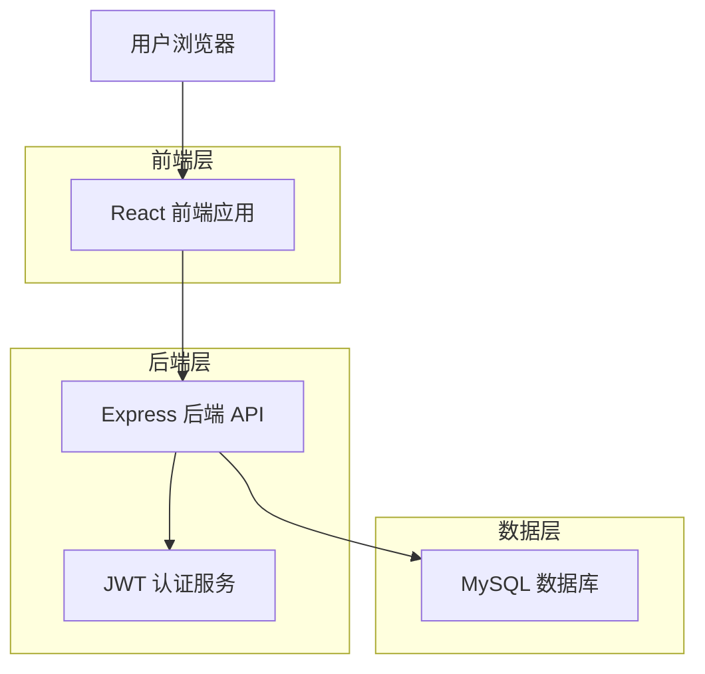
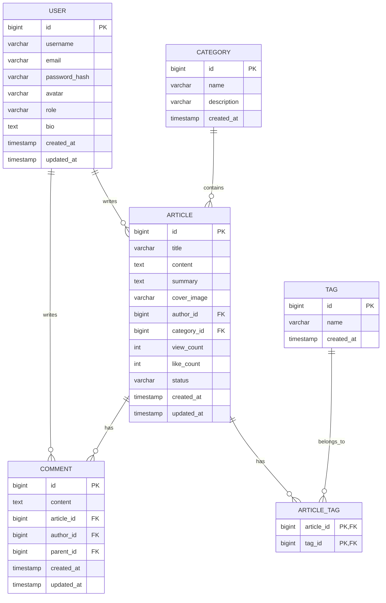

# 全栈博客应用 - 技术架构文档

## 1. 架构设计



## 2. 技术描述

- **前端**: React@18 + TypeScript@5 + Ant Design@5 + Vite@5
- **初始化工具**: vite-init
- **后端**: Node.js@20 + Express@4 + TypeScript@5
- **数据库**: MySQL@8.0
- **ORM**: TypeORM@0.3
- **认证**: JWT (jsonwebtoken)
- **密码加密**: bcryptjs

## 3. 路由定义

### 3.1 前端路由

| 路由 | 用途 |
|------|------|
| / | 首页，展示文章列表和侧边栏 |
| /article/:id | 文章详情页，展示文章内容和评论 |
| /article/edit | 文章编辑页，新建/编辑文章 |
| /login | 登录页 |
| /register | 注册页 |
| /profile | 个人中心，用户信息管理 |
| /my-articles | 我的文章列表 |

### 3.2 后端 API 路由

| 路由 | 方法 | 用途 |
|------|------|------|
| /api/auth/register | POST | 用户注册 |
| /api/auth/login | POST | 用户登录 |
| /api/auth/refresh | POST | 刷新 Token |
| /api/articles | GET | 获取文章列表 |
| /api/articles | POST | 创建文章 |
| /api/articles/:id | GET | 获取文章详情 |
| /api/articles/:id | PUT | 更新文章 |
| /api/articles/:id | DELETE | 删除文章 |
| /api/articles/:id/comments | GET | 获取文章评论 |
| /api/articles/:id/comments | POST | 发表评论 |
| /api/comments/:id | DELETE | 删除评论 |
| /api/categories | GET | 获取分类列表 |
| /api/tags | GET | 获取标签列表 |
| /api/users/profile | GET | 获取用户信息 |
| /api/users/profile | PUT | 更新用户信息 |
| /api/users/articles | GET | 获取用户文章列表 |

## 4. API 定义

### 4.1 用户认证相关

#### 注册
```
POST /api/auth/register
```

请求参数:
| 参数名 | 参数类型 | 是否必填 | 描述 |
|--------|----------|----------|------|
| username | string | 是 | 用户名，3-20 字符 |
| email | string | 是 | 邮箱地址 |
| password | string | 是 | 密码，6-20 字符 |

响应示例:
```json
{
  "code": 200,
  "message": "注册成功",
  "data": {
    "id": 1,
    "username": "testuser",
    "email": "test@example.com",
    "token": "eyJhbGciOiJIUzI1NiIs..."
  }
}
```

#### 登录
```
POST /api/auth/login
```

请求参数:
| 参数名 | 参数类型 | 是否必填 | 描述 |
|--------|----------|----------|------|
| username | string | 是 | 用户名或邮箱 |
| password | string | 是 | 密码 |

响应示例:
```json
{
  "code": 200,
  "message": "登录成功",
  "data": {
    "id": 1,
    "username": "testuser",
    "email": "test@example.com",
    "role": "user",
    "token": "eyJhbGciOiJIUzI1NiIs..."
  }
}
```

### 4.2 文章相关

#### 获取文章列表
```
GET /api/articles?page=1&pageSize=10&categoryId=&keyword=
```

响应示例:
```json
{
  "code": 200,
  "data": {
    "list": [
      {
        "id": 1,
        "title": "文章标题",
        "summary": "文章摘要...",
        "coverImage": "https://example.com/image.jpg",
        "author": {
          "id": 1,
          "username": "author",
          "avatar": "https://example.com/avatar.jpg"
        },
        "category": {
          "id": 1,
          "name": "技术"
        },
        "tags": ["React", "TypeScript"],
        "viewCount": 100,
        "likeCount": 20,
        "commentCount": 5,
        "createdAt": "2024-01-15T10:00:00Z",
        "status": "published"
      }
    ],
    "pagination": {
      "page": 1,
      "pageSize": 10,
      "total": 100
    }
  }
}
```

#### 创建文章
```
POST /api/articles
```

请求参数:
| 参数名 | 参数类型 | 是否必填 | 描述 |
|--------|----------|----------|------|
| title | string | 是 | 文章标题 |
| content | string | 是 | 文章内容（Markdown） |
| summary | string | 否 | 文章摘要 |
| coverImage | string | 否 | 封面图 URL |
| categoryId | number | 是 | 分类 ID |
| tags | string[] | 否 | 标签数组 |
| status | string | 是 | 状态：draft/published |

### 4.3 评论相关

#### 发表评论
```
POST /api/articles/:id/comments
```

请求参数:
| 参数名 | 参数类型 | 是否必填 | 描述 |
|--------|----------|----------|------|
| content | string | 是 | 评论内容 |
| parentId | number | 否 | 父评论 ID（回复时使用） |

响应示例:
```json
{
  "code": 200,
  "data": {
    "id": 1,
    "content": "评论内容",
    "author": {
      "id": 1,
      "username": "user",
      "avatar": "https://example.com/avatar.jpg"
    },
    "parentId": null,
    "createdAt": "2024-01-15T10:00:00Z"
  }
}
```

## 5. 服务端架构图

```mermaid
graph TD
    A[客户端/前端] --> B[路由层 - Routes]
    B --> C[中间件层 - Middlewares]
    C --> D[控制器层 - Controllers]
    D --> E[服务层 - Services]
    E --> F[数据访问层 - Repositories]
    F --> G[(MySQL 数据库)]
    
    subgraph "Express 服务端"
        B
        C
        D
        E
        F
    end
    
    C --> H[JWT 认证]
    C --> I[请求验证]
    C --> J[错误处理]
```



## 6. 数据模型

### 6.1 数据模型定义



### 6.2 数据定义语言

#### 用户表 (users)
```sql
CREATE TABLE users (
    id BIGINT UNSIGNED AUTO_INCREMENT PRIMARY KEY,
    username VARCHAR(50) NOT NULL UNIQUE COMMENT '用户名',
    email VARCHAR(100) NOT NULL UNIQUE COMMENT '邮箱',
    password_hash VARCHAR(255) NOT NULL COMMENT '密码哈希',
    avatar VARCHAR(255) DEFAULT NULL COMMENT '头像URL',
    role ENUM('user', 'admin') DEFAULT 'user' COMMENT '角色',
    bio TEXT COMMENT '个人简介',
    created_at TIMESTAMP DEFAULT CURRENT_TIMESTAMP,
    updated_at TIMESTAMP DEFAULT CURRENT_TIMESTAMP ON UPDATE CURRENT_TIMESTAMP,
    INDEX idx_username (username),
    INDEX idx_email (email)
) ENGINE=InnoDB DEFAULT CHARSET=utf8mb4 COLLATE=utf8mb4_unicode_ci COMMENT='用户表';
```

#### 分类表 (categories)
```sql
CREATE TABLE categories (
    id BIGINT UNSIGNED AUTO_INCREMENT PRIMARY KEY,
    name VARCHAR(50) NOT NULL COMMENT '分类名称',
    description VARCHAR(255) DEFAULT NULL COMMENT '分类描述',
    created_at TIMESTAMP DEFAULT CURRENT_TIMESTAMP,
    UNIQUE KEY uk_name (name)
) ENGINE=InnoDB DEFAULT CHARSET=utf8mb4 COLLATE=utf8mb4_unicode_ci COMMENT='文章分类表';

-- 初始化数据
INSERT INTO categories (name, description) VALUES 
('技术', '技术相关文章'),
('生活', '生活随笔'),
('随笔', '日常记录');
```

#### 标签表 (tags)
```sql
CREATE TABLE tags (
    id BIGINT UNSIGNED AUTO_INCREMENT PRIMARY KEY,
    name VARCHAR(50) NOT NULL COMMENT '标签名称',
    created_at TIMESTAMP DEFAULT CURRENT_TIMESTAMP,
    UNIQUE KEY uk_name (name)
) ENGINE=InnoDB DEFAULT CHARSET=utf8mb4 COLLATE=utf8mb4_unicode_ci COMMENT='文章标签表';
```

#### 文章表 (articles)
```sql
CREATE TABLE articles (
    id BIGINT UNSIGNED AUTO_INCREMENT PRIMARY KEY,
    title VARCHAR(200) NOT NULL COMMENT '文章标题',
    content LONGTEXT NOT NULL COMMENT '文章内容（Markdown）',
    summary TEXT COMMENT '文章摘要',
    cover_image VARCHAR(500) DEFAULT NULL COMMENT '封面图URL',
    author_id BIGINT UNSIGNED NOT NULL COMMENT '作者ID',
    category_id BIGINT UNSIGNED DEFAULT NULL COMMENT '分类ID',
    view_count INT UNSIGNED DEFAULT 0 COMMENT '浏览量',
    like_count INT UNSIGNED DEFAULT 0 COMMENT '点赞数',
    status ENUM('draft', 'published') DEFAULT 'draft' COMMENT '文章状态',
    created_at TIMESTAMP DEFAULT CURRENT_TIMESTAMP,
    updated_at TIMESTAMP DEFAULT CURRENT_TIMESTAMP ON UPDATE CURRENT_TIMESTAMP,
    FOREIGN KEY (author_id) REFERENCES users(id) ON DELETE CASCADE,
    FOREIGN KEY (category_id) REFERENCES categories(id) ON DELETE SET NULL,
    INDEX idx_author (author_id),
    INDEX idx_category (category_id),
    INDEX idx_status (status),
    INDEX idx_created_at (created_at),
    FULLTEXT INDEX ft_title_content (title, content)
) ENGINE=InnoDB DEFAULT CHARSET=utf8mb4 COLLATE=utf8mb4_unicode_ci COMMENT='文章表';
```

#### 文章标签关联表 (article_tags)
```sql
CREATE TABLE article_tags (
    article_id BIGINT UNSIGNED NOT NULL COMMENT '文章ID',
    tag_id BIGINT UNSIGNED NOT NULL COMMENT '标签ID',
    PRIMARY KEY (article_id, tag_id),
    FOREIGN KEY (article_id) REFERENCES articles(id) ON DELETE CASCADE,
    FOREIGN KEY (tag_id) REFERENCES tags(id) ON DELETE CASCADE
) ENGINE=InnoDB DEFAULT CHARSET=utf8mb4 COLLATE=utf8mb4_unicode_ci COMMENT='文章标签关联表';
```

#### 评论表 (comments)
```sql
CREATE TABLE comments (
    id BIGINT UNSIGNED AUTO_INCREMENT PRIMARY KEY,
    content TEXT NOT NULL COMMENT '评论内容',
    article_id BIGINT UNSIGNED NOT NULL COMMENT '文章ID',
    author_id BIGINT UNSIGNED NOT NULL COMMENT '评论者ID',
    parent_id BIGINT UNSIGNED DEFAULT NULL COMMENT '父评论ID（回复）',
    created_at TIMESTAMP DEFAULT CURRENT_TIMESTAMP,
    updated_at TIMESTAMP DEFAULT CURRENT_TIMESTAMP ON UPDATE CURRENT_TIMESTAMP,
    FOREIGN KEY (article_id) REFERENCES articles(id) ON DELETE CASCADE,
    FOREIGN KEY (author_id) REFERENCES users(id) ON DELETE CASCADE,
    FOREIGN KEY (parent_id) REFERENCES comments(id) ON DELETE CASCADE,
    INDEX idx_article (article_id),
    INDEX idx_author (author_id),
    INDEX idx_parent (parent_id)
) ENGINE=InnoDB DEFAULT CHARSET=utf8mb4 COLLATE=utf8mb4_unicode_ci COMMENT='评论表';
```

## 7. 项目结构

### 7.1 整体结构

```
blog-app/
├── frontend/                 # 前端项目
│   ├── public/
│   ├── src/
│   │   ├── api/             # API 接口封装
│   │   ├── assets/          # 静态资源
│   │   ├── components/      # 公共组件
│   │   ├── hooks/           # 自定义 Hooks
│   │   ├── layouts/         # 布局组件
│   │   ├── pages/           # 页面组件
│   │   ├── router/          # 路由配置
│   │   ├── stores/          # 状态管理
│   │   ├── styles/          # 全局样式
│   │   ├── types/           # TypeScript 类型定义
│   │   ├── utils/           # 工具函数
│   │   ├── App.tsx
│   │   └── main.tsx
│   ├── index.html
│   ├── package.json
│   ├── tsconfig.json
│   └── vite.config.ts
│
├── backend/                  # 后端项目
│   ├── src/
│   │   ├── config/          # 配置文件
│   │   ├── controllers/     # 控制器
│   │   ├── entities/        # 数据实体
│   │   ├── middlewares/     # 中间件
│   │   ├── routes/          # 路由定义
│   │   ├── services/        # 业务逻辑
│   │   ├── utils/           # 工具函数
│   │   └── index.ts         # 入口文件
│   ├── uploads/             # 上传文件目录
│   ├── package.json
│   ├── tsconfig.json
│   └── ormconfig.json       # TypeORM 配置
│
├── database/                 # 数据库脚本
│   └── init.sql             # 初始化 SQL
│
├── docker-compose.yml        # Docker 编排
└── README.md                 # 项目说明
```

### 7.2 前端项目结构

```
frontend/src/
├── api/
│   ├── request.ts           # Axios 封装
│   ├── auth.ts              # 认证接口
│   ├── article.ts           # 文章接口
│   ├── comment.ts           # 评论接口
│   └── user.ts              # 用户接口
├── components/
│   ├── ArticleCard/         # 文章卡片
│   ├── ArticleList/         # 文章列表
│   ├── CommentList/         # 评论列表
│   ├── Editor/              # 富文本编辑器
│   ├── Header/              # 顶部导航
│   ├── Sidebar/             # 侧边栏
│   └── Footer/              # 页脚
├── layouts/
│   ├── MainLayout.tsx       # 主布局
│   └── AuthLayout.tsx       # 认证页布局
├── pages/
│   ├── Home/                # 首页
│   ├── ArticleDetail/       # 文章详情
│   ├── ArticleEdit/         # 文章编辑
│   ├── Login/               # 登录
│   ├── Register/            # 注册
│   ├── Profile/             # 个人中心
│   └── MyArticles/          # 我的文章
├── router/
│   └── index.tsx            # 路由配置
├── stores/
│   ├── authStore.ts         # 认证状态
│   └── articleStore.ts      # 文章状态
├── types/
│   ├── user.ts              # 用户类型
│   ├── article.ts           # 文章类型
│   └── comment.ts           # 评论类型
└── utils/
    ├── storage.ts           # 本地存储
    └── format.ts            # 格式化工具
```

### 7.3 后端项目结构

```
backend/src/
├── config/
│   ├── database.ts          # 数据库配置
│   └── jwt.ts               # JWT 配置
├── controllers/
│   ├── authController.ts    # 认证控制器
│   ├── articleController.ts # 文章控制器
│   ├── commentController.ts # 评论控制器
│   ├── categoryController.ts# 分类控制器
│   └── userController.ts    # 用户控制器
├── entities/
│   ├── User.ts              # 用户实体
│   ├── Article.ts           # 文章实体
│   ├── Comment.ts           # 评论实体
│   ├── Category.ts          # 分类实体
│   └── Tag.ts               # 标签实体
├── middlewares/
│   ├── auth.ts              # 认证中间件
│   ├── errorHandler.ts      # 错误处理
│   └── validator.ts         # 请求验证
├── routes/
│   ├── auth.ts              # 认证路由
│   ├── article.ts           # 文章路由
│   ├── comment.ts           # 评论路由
│   ├── category.ts          # 分类路由
│   └── user.ts              # 用户路由
├── services/
│   ├── authService.ts       # 认证服务
│   ├── articleService.ts    # 文章服务
│   ├── commentService.ts    # 评论服务
│   └── userService.ts       # 用户服务
└── utils/
    ├── response.ts          # 响应封装
    └── password.ts          # 密码工具
```

## 8. 启动命令

### 8.1 开发环境启动

#### 前端启动
```bash
cd frontend
npm install
npm run dev
# 服务运行在 http://localhost:5173
```

#### 后端启动
```bash
cd backend
npm install
npm run dev
# 服务运行在 http://localhost:3000
```

#### 数据库启动（使用 Docker）
```bash
# 启动 MySQL
docker run -d \
  --name blog-mysql \
  -e MYSQL_ROOT_PASSWORD=root123 \
  -e MYSQL_DATABASE=blog_db \
  -p 3306:3306 \
  mysql:8.0

# 执行初始化脚本
docker exec -i blog-mysql mysql -uroot -proot123 blog_db < database/init.sql
```

### 8.2 生产环境部署

#### 前端构建
```bash
cd frontend
npm install
npm run build
# 构建产物在 dist/ 目录
```

#### 后端构建
```bash
cd backend
npm install
npm run build
npm start
```

#### Docker Compose 部署
```yaml
version: '3.8'

services:
  mysql:
    image: mysql:8.0
    container_name: blog-mysql
    environment:
      MYSQL_ROOT_PASSWORD: root123
      MYSQL_DATABASE: blog_db
    ports:
      - "3306:3306"
    volumes:
      - mysql_data:/var/lib/mysql
      - ./database/init.sql:/docker-entrypoint-initdb.d/init.sql
    networks:
      - blog-network

  backend:
    build: ./backend
    container_name: blog-backend
    ports:
      - "3000:3000"
    environment:
      DB_HOST: mysql
      DB_PORT: 3306
      DB_USER: root
      DB_PASSWORD: root123
      DB_NAME: blog_db
      JWT_SECRET: your-secret-key
    depends_on:
      - mysql
    networks:
      - blog-network

  frontend:
    build: ./frontend
    container_name: blog-frontend
    ports:
      - "80:80"
    depends_on:
      - backend
    networks:
      - blog-network

volumes:
  mysql_data:

networks:
  blog-network:
    driver: bridge
```

## 9. 环境变量配置

### 前端 (.env)
```
VITE_API_BASE_URL=http://localhost:3000/api
```

### 后端 (.env)
```
# 服务器配置
PORT=3000
NODE_ENV=development

# 数据库配置
DB_HOST=localhost
DB_PORT=3306
DB_USER=root
DB_PASSWORD=root123
DB_NAME=blog_db

# JWT 配置
JWT_SECRET=your-secret-key-here
JWT_EXPIRES_IN=7d

# 文件上传配置
UPLOAD_DIR=uploads
MAX_FILE_SIZE=5242880
```

## 10. 部署说明

### 10.1 服务器要求

- Node.js >= 18.0.0
- MySQL >= 8.0
- Nginx（用于反向代理和静态文件服务）

### 10.2 部署步骤

1. **服务器环境准备**
   ```bash
   # 安装 Node.js
   curl -fsSL https://deb.nodesource.com/setup_18.x | sudo -E bash -
   sudo apt-get install -y nodejs
   
   # 安装 MySQL
   sudo apt-get install mysql-server
   
   # 安装 Nginx
   sudo apt-get install nginx
   ```

2. **数据库初始化**
   ```bash
   mysql -u root -p < database/init.sql
   ```

3. **后端部署**
   ```bash
   cd backend
   npm install --production
   npm run build
   # 使用 PM2 启动
   npm install -g pm2
   pm2 start dist/index.js --name blog-backend
   ```

4. **前端部署**
   ```bash
   cd frontend
   npm install
   npm run build
   # 将 dist 目录复制到 Nginx 目录
   sudo cp -r dist/* /var/www/blog/
   ```

5. **Nginx 配置**
   ```nginx
   server {
       listen 80;
       server_name your-domain.com;
       
       # 前端静态文件
       location / {
           root /var/www/blog;
           index index.html;
           try_files $uri $uri/ /index.html;
       }
       
       # 后端 API 代理
       location /api {
           proxy_pass http://localhost:3000;
           proxy_http_version 1.1;
           proxy_set_header Upgrade $http_upgrade;
           proxy_set_header Connection 'upgrade';
           proxy_set_header Host $host;
           proxy_cache_bypass $http_upgrade;
       }
   }
   ```

6. **启动服务**
   ```bash
   sudo nginx -s reload
   pm2 start blog-backend
   ```
