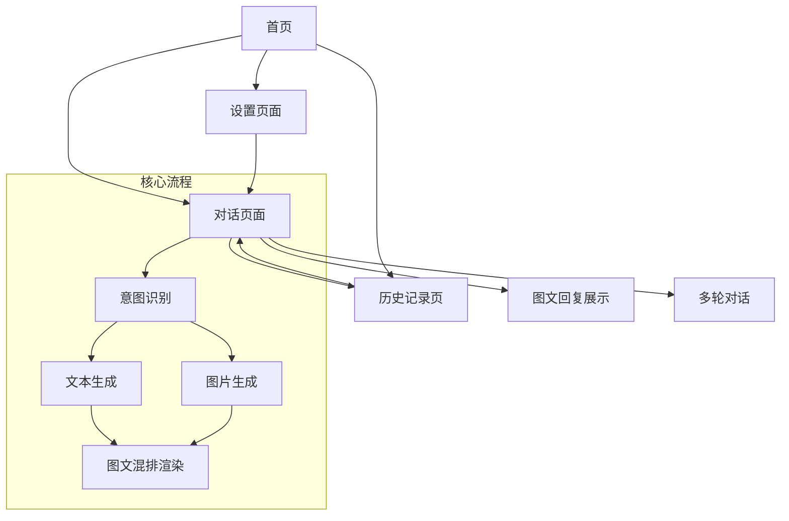

# 问答Agent系统 - 产品需求文档

## 1. 产品概述

问答Agent系统是一个基于大语言模型的智能问答平台，能够准确识别用户意图并生成图文混排的高质量回复。系统支持五大类专业领域（美食、科学科普、教程指南、医疗健康、实体对比）的问答需求，通过AI动态生成配图，提供直观、专业、易懂的交互体验。

**目标用户**：需要获取专业知识、教程指导、对比分析的普通用户和专业人士。
**核心价值**：将复杂的专业知识转化为易于理解的图文内容，降低学习门槛，提升信息获取效率。

***

## 2. 核心功能

### 2.1 用户角色

| 角色   | 注册方式     | 核心权限             |
| ---- | -------- | ---------------- |
| 访客用户 | 无需注册     | 基础问答、浏览历史（会话级）   |
| 普通用户 | 邮箱/手机号注册 | 多轮对话、历史记录保存、收藏问答 |
| 高级用户 | 订阅升级     | 优先响应、高清图片生成、批量导出 |

### 2.2 功能模块

系统包含以下核心页面：

1. **首页**：品牌展示、快捷入口、热门问题推荐、使用引导
2. **对话页面**：聊天界面、意图识别展示、图文回复渲染、多轮对话支持
3. **历史记录页面**：问答历史列表、搜索筛选、收藏管理
4. **设置页面**：用户偏好、API配置、图片生成参数设置

### 2.3 页面详情

| 页面名称  | 模块名称   | 功能描述                             |
| ----- | ------ | -------------------------------- |
| 首页    | Hero区域 | 展示系统核心价值和五大领域能力，配合动态示例展示         |
| 首页    | 快捷入口   | 提供五大领域的一键进入按钮，预置常见问题模板           |
| 首页    | 热门推荐   | 展示各领域的热门问答，支持点击查看详情              |
| 首页    | 使用引导   | 新用户引导流程，演示如何使用图文问答功能             |
| 对话页   | 聊天界面   | 消息输入框、发送按钮、语音输入（可选）、文件上传（可选）     |
| 对话页   | 意图识别展示 | 实时显示识别到的用户意图类别和置信度               |
| 对话页   | 图文回复区  | 渲染Markdown格式文本，内嵌AI生成图片，支持图片放大查看 |
| 对话页   | 多轮对话   | 上下文关联显示，支持追问、澄清、话题切换             |
| 对话页   | 图片控制   | 支持重新生成图片、调整图片风格、下载图片             |
| 历史记录页 | 列表展示   | 按时间倒序展示历史问答，显示预览和关键信息            |
| 历史记录页 | 搜索筛选   | 按领域、关键词、时间范围筛选历史记录               |
| 历史记录页 | 收藏管理   | 收藏/取消收藏、收藏夹分类管理                  |
| 设置页   | 用户偏好   | 设置默认图片风格、回复详细程度、语言偏好             |
| 设置页   | 图片参数   | 配置图片尺寸、质量、生成模型选择                 |

***

## 3. 核心流程

### 3.1 用户问答流程

1. 用户进入对话页面，输入问题
2. 系统实时分析用户输入，识别意图类别（美食/科普/教程/医疗/对比）
3. 系统根据意图类型调用相应的知识库和处理逻辑
4. 生成结构化文本回复，同时构建图片生成提示词
5. 调用AI图片生成服务获取配图
6. 将图文内容整合渲染，展示给用户
7. 用户可进行追问或发起新话题

### 3.2 多轮对话流程

1. 系统维护对话上下文，包含历史问答和已识别意图
2. 用户输入新问题时，结合上下文进行意图更新或延续
3. 如检测到话题切换，系统提示用户确认是否开启新话题
4. 追问场景下，保持当前意图，优化回复内容

### 3.3 页面导航流程图

***

## 4. 用户界面设计

### 4.1 设计风格

* **主色调**：科技蓝（#3B82F6）为主，搭配纯净白（#FFFFFF）背景

* **辅助色**：

  * 美食类：暖橙色（#F97316）

  * 科普类：翠绿（#10B981）

  * 教程类：紫罗兰（#8B5CF6）

  * 医疗类：专业蓝（#0EA5E9）

  * 对比类：琥珀色（#F59E0B）

* **按钮样式**：圆角矩形（8px圆角），主按钮填充色，次按钮描边

* **字体**：系统默认无衬线字体，正文16px，标题20-24px

* **布局**：左侧边栏导航，右侧主内容区，对话页采用经典聊天布局

* **图标**：使用Lucide图标库，简洁线性风格

### 4.2 页面设计概述

| 页面名称 | 模块名称   | UI元素                               |
| ---- | ------ | ---------------------------------- |
| 首页   | Hero区域 | 全宽渐变背景，居中大标题，动态打字机效果展示示例问题，CTA按钮   |
| 首页   | 领域卡片   | 5个彩色卡片网格布局，悬停放大动效，图标+标题+简介         |
| 首页   | 热门推荐   | 横向滚动卡片，显示问题预览和配图缩略图                |
| 对话页  | 聊天界面   | 底部固定输入框，消息气泡区分用户/AI，支持Markdown渲染   |
| 对话页  | 意图标签   | 消息顶部显示彩色意图标签，带置信度指示器               |
| 对话页  | 图片展示   | 图片卡片带圆角阴影，悬停显示操作按钮（放大、重生成、下载）      |
| 对话页  | 加载状态   | 骨架屏+脉冲动画，显示"正在分析意图..."、"正在生成图片..." |
| 历史页  | 列表项    | 左侧缩略图，右侧标题摘要，底部时间和操作按钮             |
| 历史页  | 筛选栏    | 下拉选择器+搜索框+日期范围选择                   |

### 4.3 响应式设计

* **桌面优先**：主设计基于1440px宽度，最大内容区1200px

* **平板适配**：768px-1024px，侧边栏可收起，网格布局调整为2列

* **移动端**：768px以下，底部固定导航，单列布局，图片全宽展示

* **触摸优化**：按钮最小44px点击区域，支持滑动操作

### 4.4 交互动效

* 消息发送：输入框内容飞入动画，AI回复打字机效果

* 图片生成：渐进式加载，从模糊到清晰

* 意图识别：标签滑入动画，置信度进度条填充

* 页面切换：淡入淡出过渡，200ms时长

***

## 5. 五大领域详细需求

### 5.1 美食类意图

**识别关键词**：食谱、做法、食材、烹饪、美食推荐、餐厅、菜系

**回复内容结构**：

1. 菜品/食材简介
2. 所需材料清单
3. 详细步骤说明
4. 小贴士/变体建议

**图片生成要求**：

* 成品展示图：俯拍角度，专业美食摄影风格

* 食材特写：新鲜食材，自然光线

* 步骤图：简洁示意图，标注关键动作

### 5.2 科学科普类意图

**识别关键词**：是什么、为什么、原理、动物、植物、地理、物理、化学

**回复内容结构**：

1. 概念定义
2. 原理解释
3. 实际应用/案例
4. 拓展知识

**图片生成要求**：

* 动植物：科学插画风格，标注关键部位

* 地理现象：示意图+实景结合

* 物理化学：原理演示图，箭头标注力/反应方向

### 5.3 教程指南类意图

**识别关键词**：如何使用、教程、步骤、操作、设置、技巧

**回复内容结构**：

1. 目标说明
2. 准备工作
3. 分步骤操作指南
4. 常见问题

**图片生成要求**：

* 界面截图风格：模拟真实软件界面

* 步骤分解：编号步骤图，高亮操作区域

* 技巧演示：前后对比图，标注关键点

### 5.4 医疗健康类意图

**识别关键词**：症状、疾病、器官、健康、治疗、预防

**回复内容结构**：

1. 医学概念解释
2. 详细说明（结构/机制/症状）
3. 注意事项
4. **免责声明**：内容仅供参考，不构成医疗建议

**图片生成要求**：

* 人体结构：解剖示意图，专业医学插画风格

* 疾病示意：病理变化对比，标注病变区域

* 健康指导：信息图风格，清晰直观

### 5.5 实体对比类意图

**识别关键词**：区别、对比、vs、比较、哪个更好、差异

**回复内容结构**：

1. 实体简介
2. 对比维度分析
3. 对比表格
4. 总结建议

**图片生成要求**：

* 并排对比图：左右/上下分栏，相同视角

* 特征标注：用颜色/箭头标注差异点

* 信息图：雷达图、对比柱状图可视化

***

## 6. 非功能性需求

### 6.1 性能要求

* 意图识别响应时间 < 500ms

* 文本生成首字响应时间 < 2s

* 图片生成完成时间 < 10s（显示进度）

* 页面首屏加载时间 < 3s

### 6.2 质量要求

* 意图识别准确率 ≥ 90%

* 图文相关性评分 ≥ 4.0/5.0

* 用户满意度 ≥ 85%

### 6.3 安全与合规

* 医疗健康内容必须包含免责声明

* 图片生成需过滤敏感内容

* 用户数据加密存储

* 遵守AI生成内容标识要求

### 6.4 可扩展性

* 支持新增意图类别

* 支持多语言扩展

* 支持新的图片生成模型接入

