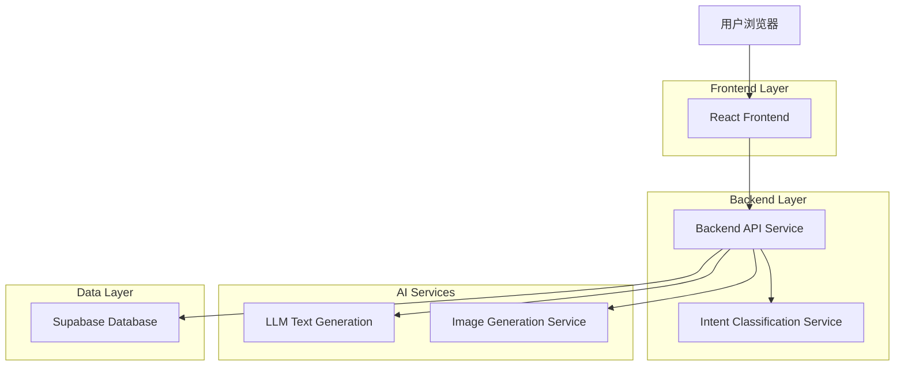
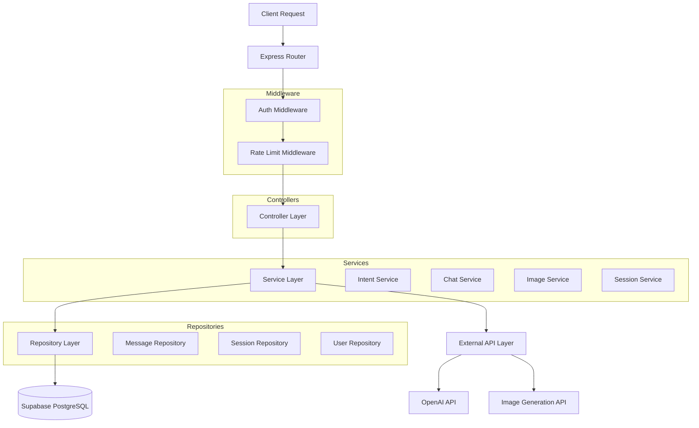
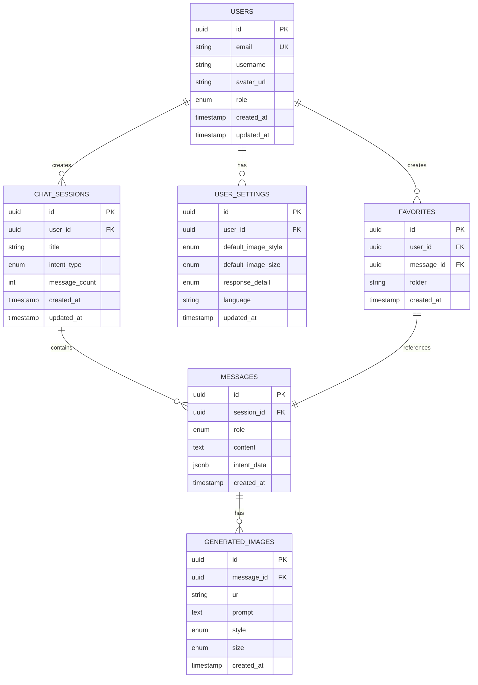
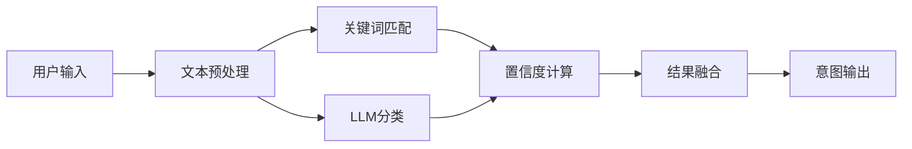
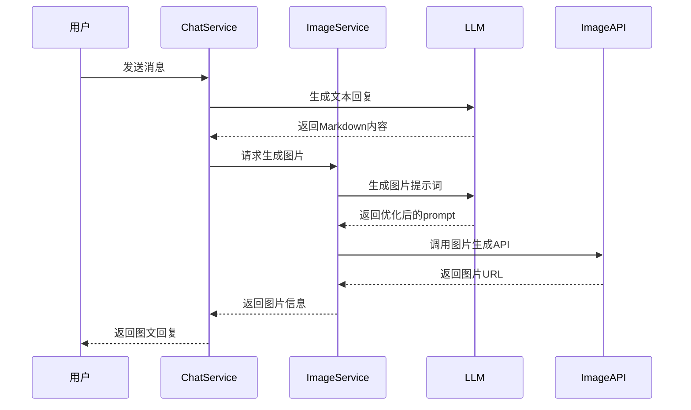
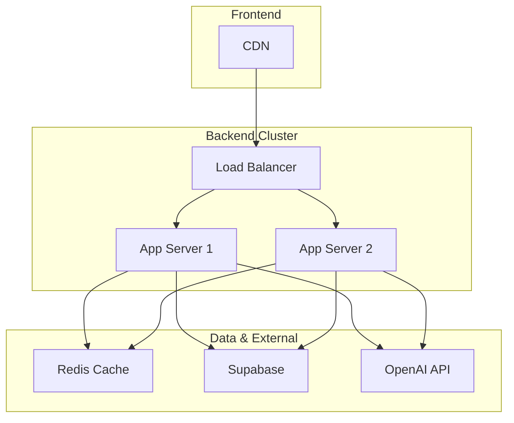

# 问答Agent系统 - 技术架构文档

## 1. 架构设计



---

## 2. 技术描述

### 2.1 技术栈选型

| 层级 | 技术 | 版本 | 说明 |
|------|------|------|------|
| 前端 | React | 18.x | UI框架，函数组件+Hooks |
| 前端 | TypeScript | 5.x | 类型安全 |
| 前端 | Tailwind CSS | 3.x | 原子化CSS框架 |
| 前端 | Vite | 5.x | 构建工具，开发服务器 |
| 前端 | React Query | 5.x | 服务端状态管理 |
| 前端 | Zustand | 4.x | 客户端状态管理 |
| 前端 | React Markdown | 9.x | Markdown渲染 |
| 前端 | Lucide React | 0.x | 图标库 |
| 后端 | Node.js | 20.x | 运行环境 |
| 后端 | Express | 4.x | Web框架 |
| 后端 | TypeScript | 5.x | 类型安全 |
| 数据库 | Supabase | - | PostgreSQL + 认证 + 存储 |
| AI | OpenAI API | - | 文本生成、意图识别 |
| AI | DALL-E/Stable Diffusion | - | 图片生成 |

### 2.2 初始化工具

- **前端**: `vite-init` - 使用Vite官方模板创建React+TypeScript项目
- **后端**: `express-generator-typescript` 或手动配置Express+TypeScript

---

## 3. 路由定义

### 3.1 前端路由

| 路由 | 页面 | 说明 |
|------|------|------|
| `/` | Home | 首页，展示系统介绍和快捷入口 |
| `/chat` | Chat | 对话页面，核心问答功能 |
| `/chat/:sessionId` | Chat | 指定会话的对话页面 |
| `/history` | History | 历史记录列表 |
| `/favorites` | Favorites | 收藏列表 |
| `/settings` | Settings | 用户设置 |
| `/login` | Login | 登录页面 |
| `/register` | Register | 注册页面 |

### 3.2 后端API路由

| 路由 | 方法 | 说明 |
|------|------|------|
| `/api/auth/*` | - | 认证相关（委托给Supabase） |
| `/api/chat` | POST | 发送消息，获取回复 |
| `/api/chat/stream` | POST | 流式消息接口 |
| `/api/sessions` | GET/POST | 会话列表/创建 |
| `/api/sessions/:id` | GET/DELETE | 会话详情/删除 |
| `/api/sessions/:id/messages` | GET | 会话消息历史 |
| `/api/intent/classify` | POST | 意图识别接口 |
| `/api/image/generate` | POST | 图片生成接口 |
| `/api/history` | GET | 获取历史记录 |
| `/api/favorites` | GET/POST | 收藏列表/添加 |
| `/api/favorites/:id` | DELETE | 取消收藏 |
| `/api/settings` | GET/PUT | 获取/更新设置 |

---

## 4. API定义

### 4.1 核心API类型定义

```typescript
// 意图类型
enum IntentType {
  FOOD = 'food',           // 美食类
  SCIENCE = 'science',     // 科学科普类
  TUTORIAL = 'tutorial',   // 教程指南类
  MEDICAL = 'medical',     // 医疗健康类
  COMPARISON = 'comparison', // 实体对比类
  UNKNOWN = 'unknown'      // 未知
}

// 意图识别结果
interface IntentResult {
  type: IntentType;
  confidence: number;  // 0-1
  subType?: string;    // 子类型，如food:recipe, food:ingredient
  entities?: string[]; // 提取的实体
}

// 消息类型
interface Message {
  id: string;
  sessionId: string;
  role: 'user' | 'assistant' | 'system';
  content: string;
  intent?: IntentResult;
  images?: GeneratedImage[];
  createdAt: string;
}

// 生成的图片
interface GeneratedImage {
  id: string;
  url: string;
  prompt: string;
  style: ImageStyle;
  size: '256x256' | '512x512' | '1024x1024';
}

// 图片风格
enum ImageStyle {
  REALISTIC = 'realistic',
  ILLUSTRATION = 'illustration',
  DIAGRAM = 'diagram',
  PHOTO = 'photo'
}

// 会话
interface ChatSession {
  id: string;
  userId: string;
  title: string;
  intentType?: IntentType;
  messageCount: number;
  createdAt: string;
  updatedAt: string;
}

// 用户设置
interface UserSettings {
  userId: string;
  defaultImageStyle: ImageStyle;
  defaultImageSize: '256x256' | '512x512' | '1024x1024';
  responseDetail: 'concise' | 'normal' | 'detailed';
  language: 'zh' | 'en';
}
```

### 4.2 主要API详情

#### 意图识别接口

```
POST /api/intent/classify
```

请求：
| 参数名 | 类型 | 必填 | 说明 |
|--------|------|------|------|
| query | string | 是 | 用户输入文本 |
| context | string[] | 否 | 上下文消息 |

响应：
```json
{
  "success": true,
  "data": {
    "type": "food",
    "confidence": 0.95,
    "subType": "recipe",
    "entities": ["红烧肉", "五花肉"]
  }
}
```

#### 聊天接口

```
POST /api/chat
```

请求：
| 参数名 | 类型 | 必填 | 说明 |
|--------|------|------|------|
| sessionId | string | 是 | 会话ID |
| message | string | 是 | 用户消息 |
| generateImage | boolean | 否 | 是否生成图片，默认true |

响应：
```json
{
  "success": true,
  "data": {
    "messageId": "msg_xxx",
    "content": "## 红烧肉做法\n\n红烧肉是一道经典的中式菜肴...",
    "intent": {
      "type": "food",
      "confidence": 0.98
    },
    "images": [
      {
        "id": "img_xxx",
        "url": "https://...",
        "prompt": "红烧肉成品图，专业美食摄影..."
      }
    ]
  }
}
```

#### 流式聊天接口

```
POST /api/chat/stream
```

SSE流式响应，格式：
```
event: intent
data: {"type":"food","confidence":0.95}

event: text
data: {"chunk":"红烧肉"}

event: image_start
data: {"imageId":"img_xxx"}

event: image_complete
data: {"imageId":"img_xxx","url":"https://..."}

event: done
data: {}
```

#### 图片生成接口

```
POST /api/image/generate
```

请求：
| 参数名 | 类型 | 必填 | 说明 |
|--------|------|------|------|
| prompt | string | 是 | 图片生成提示词 |
| style | string | 否 | 图片风格 |
| size | string | 否 | 图片尺寸 |

响应：
```json
{
  "success": true,
  "data": {
    "id": "img_xxx",
    "url": "https://...",
    "prompt": "..."
  }
}
```

---

## 5. 服务端架构图



---

## 6. 数据模型

### 6.1 ER图



### 6.2 数据定义语言

```sql
-- 用户表
CREATE TABLE users (
    id UUID PRIMARY KEY DEFAULT gen_random_uuid(),
    email VARCHAR(255) UNIQUE NOT NULL,
    username VARCHAR(100) NOT NULL,
    avatar_url TEXT,
    role VARCHAR(20) DEFAULT 'user' CHECK (role IN ('user', 'premium', 'admin')),
    created_at TIMESTAMP WITH TIME ZONE DEFAULT NOW(),
    updated_at TIMESTAMP WITH TIME ZONE DEFAULT NOW()
);

-- 聊天会话表
CREATE TABLE chat_sessions (
    id UUID PRIMARY KEY DEFAULT gen_random_uuid(),
    user_id UUID REFERENCES users(id) ON DELETE CASCADE,
    title VARCHAR(255) NOT NULL,
    intent_type VARCHAR(50),
    message_count INTEGER DEFAULT 0,
    created_at TIMESTAMP WITH TIME ZONE DEFAULT NOW(),
    updated_at TIMESTAMP WITH TIME ZONE DEFAULT NOW()
);

-- 消息表
CREATE TABLE messages (
    id UUID PRIMARY KEY DEFAULT gen_random_uuid(),
    session_id UUID REFERENCES chat_sessions(id) ON DELETE CASCADE,
    role VARCHAR(20) NOT NULL CHECK (role IN ('user', 'assistant', 'system')),
    content TEXT NOT NULL,
    intent_data JSONB,
    created_at TIMESTAMP WITH TIME ZONE DEFAULT NOW()
);

-- 生成图片表
CREATE TABLE generated_images (
    id UUID PRIMARY KEY DEFAULT gen_random_uuid(),
    message_id UUID REFERENCES messages(id) ON DELETE CASCADE,
    url TEXT NOT NULL,
    prompt TEXT NOT NULL,
    style VARCHAR(50) DEFAULT 'realistic',
    size VARCHAR(20) DEFAULT '512x512',
    created_at TIMESTAMP WITH TIME ZONE DEFAULT NOW()
);

-- 用户设置表
CREATE TABLE user_settings (
    id UUID PRIMARY KEY DEFAULT gen_random_uuid(),
    user_id UUID REFERENCES users(id) ON DELETE CASCADE UNIQUE,
    default_image_style VARCHAR(50) DEFAULT 'realistic',
    default_image_size VARCHAR(20) DEFAULT '512x512',
    response_detail VARCHAR(20) DEFAULT 'normal' CHECK (response_detail IN ('concise', 'normal', 'detailed')),
    language VARCHAR(10) DEFAULT 'zh',
    updated_at TIMESTAMP WITH TIME ZONE DEFAULT NOW()
);

-- 收藏表
CREATE TABLE favorites (
    id UUID PRIMARY KEY DEFAULT gen_random_uuid(),
    user_id UUID REFERENCES users(id) ON DELETE CASCADE,
    message_id UUID REFERENCES messages(id) ON DELETE CASCADE,
    folder VARCHAR(100) DEFAULT 'default',
    created_at TIMESTAMP WITH TIME ZONE DEFAULT NOW(),
    UNIQUE(user_id, message_id)
);

-- 创建索引
CREATE INDEX idx_chat_sessions_user_id ON chat_sessions(user_id);
CREATE INDEX idx_chat_sessions_created_at ON chat_sessions(created_at DESC);
CREATE INDEX idx_messages_session_id ON messages(session_id);
CREATE INDEX idx_messages_created_at ON messages(created_at);
CREATE INDEX idx_generated_images_message_id ON generated_images(message_id);
CREATE INDEX idx_favorites_user_id ON favorites(user_id);

-- 权限设置
GRANT SELECT, INSERT, UPDATE, DELETE ON users TO authenticated;
GRANT SELECT, INSERT, UPDATE, DELETE ON chat_sessions TO authenticated;
GRANT SELECT, INSERT, UPDATE, DELETE ON messages TO authenticated;
GRANT SELECT, INSERT, UPDATE, DELETE ON generated_images TO authenticated;
GRANT SELECT, INSERT, UPDATE, DELETE ON user_settings TO authenticated;
GRANT SELECT, INSERT, DELETE ON favorites TO authenticated;
```

---

## 7. 意图识别模块设计

### 7.1 意图分类器架构



### 7.2 意图识别Prompt模板

```
你是一个意图分类专家。请分析用户输入，判断其属于以下哪一类意图：

1. food - 美食类：食谱、做法、食材、烹饪技巧、餐厅推荐
2. science - 科学科普类：动植物、地理、物理、化学、天文等知识
3. tutorial - 教程指南类：软件使用、设备操作、生活技巧、DIY
4. medical - 医疗健康类：人体结构、疾病、症状、健康建议
5. comparison - 实体对比类：比较、区别、vs、优劣对比

请输出JSON格式：
{
  "type": "意图类型",
  "confidence": 0.95,
  "subType": "子类型",
  "entities": ["提取的实体1", "实体2"],
  "reason": "判断理由"
}

用户输入：{user_input}
```

---

## 8. 图片生成模块设计

### 8.1 图片生成流程



### 8.2 图片提示词生成模板

根据意图类型，使用不同的提示词模板：

**美食类**：
```
专业美食摄影，{菜品名称}，{角度}，{光线}，高清细节，食欲感，白色背景/木质桌面
```

**科普类**：
```
科学插画风格，{主题}，标注关键部位，教育用途，清晰简洁，白色背景
```

**教程类**：
```
步骤分解图，{操作内容}，编号标注，界面截图风格，高亮操作区域，清晰直观
```

**医疗类**：
```
医学插画，{人体部位/疾病}，解剖示意图，专业准确，标注结构，教育用途
```

**对比类**：
```
并排对比图，{实体A} vs {实体B}，相同视角，标注差异点，信息图风格
```

---

## 9. 部署架构



---

## 10. 开发规范

### 10.1 代码规范

- 使用ESLint + Prettier进行代码格式化
- 函数组件使用箭头函数
- 类型定义优先使用interface
- API调用使用统一的request封装
- 错误处理使用try-catch + 全局错误边界

### 10.2 目录结构

```
qa-agent/
├── frontend/                 # React前端
│   ├── src/
│   │   ├── components/       # 组件
│   │   ├── pages/           # 页面
│   │   ├── hooks/           # 自定义Hooks
│   │   ├── services/        # API服务
│   │   ├── stores/          # 状态管理
│   │   ├── types/           # 类型定义
│   │   └── utils/           # 工具函数
│   └── package.json
├── backend/                  # Express后端
│   ├── src/
│   │   ├── controllers/     # 控制器
│   │   ├── services/        # 业务逻辑
│   │   ├── middlewares/     # 中间件
│   │   ├── routes/          # 路由
│   │   ├── models/          # 数据模型
│   │   ├── types/           # 类型定义
│   │   └── utils/           # 工具函数
│   └── package.json
└── docs/                     # 文档
```

### 10.3 环境变量

```bash
# 前端
VITE_API_BASE_URL=http://localhost:3001/api
VITE_SUPABASE_URL=
VITE_SUPABASE_ANON_KEY=

# 后端
PORT=3001
NODE_ENV=development
SUPABASE_URL=
SUPABASE_SERVICE_KEY=
OPENAI_API_KEY=
IMAGE_GEN_API_KEY=
REDIS_URL=
```
