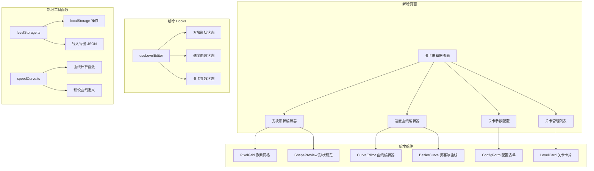
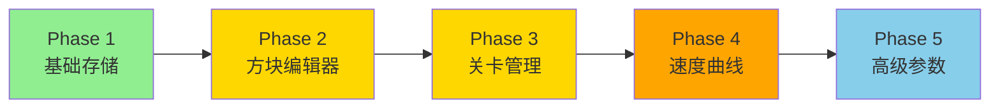

# 俄罗斯方块关卡编辑器功能评估报告

## 1. 功能需求拆解

### 1.1 自定义方块形状编辑器
- **网格编辑器**：提供 4x4 或 5x5 的可交互网格，用户点击格子来绘制方块形状
- **多旋转状态管理**：支持为自定义方块定义 1-4 种旋转状态
- **颜色选择器**：为自定义方块选择颜色
- **实时预览**：在编辑器中实时预览方块形状
- **方块库管理**：保存、删除、重命名自定义方块

### 1.2 速度曲线编辑器
- **可视化曲线编辑**：使用贝塞尔曲线或折线图编辑器
- **关键帧设置**：允许在特定等级设置下落速度
- **预设曲线**：提供线性、指数、对数等预设曲线
- **实时预览**：显示当前设置下的速度变化趋势

### 1.3 关卡参数配置
- **棋盘尺寸**：自定义棋盘宽度和高度（默认 10x20）
- **目标分数**：设置通关所需分数
- **初始等级**：设置关卡起始等级
- **方块生成概率**：调整各类型方块的出现权重
- **计分倍率**：自定义消行得分倍率

### 1.4 关卡保存/加载功能
- **本地存储**：使用 localStorage 保存关卡配置
- **导入/导出**：支持 JSON 格式的关卡文件导入导出
- **关卡列表**：展示已保存的关卡，支持预览和加载
- **默认恢复**：一键恢复默认设置

---

## 2. 技术实现分析

### 2.1 现有代码架构适配性评估

| 模块 | 现有实现 | 适配度 | 需修改内容 |
|------|----------|--------|------------|
| 方块定义 | `TETROMINO_SHAPES` 硬编码常量 | ⭐⭐⭐ 高 | 改为可配置的数据结构 |
| 游戏状态 | `useGameState` Hook | ⭐⭐⭐ 高 | 支持传入自定义配置 |
| 速度计算 | `getDropInterval()` 线性函数 | ⭐⭐⭐ 高 | 支持自定义速度曲线函数 |
| 碰撞检测 | `collision.ts` 通用算法 | ⭐⭐⭐⭐⭐ 极高 | 无需修改 |
| 旋转逻辑 | `tetrominos.ts` 旋转函数 | ⭐⭐⭐ 高 | 支持任意形状的旋转计算 |
| 计分系统 | `scoring.ts` 固定倍率 | ⭐⭐⭐ 高 | 支持自定义计分规则 |

### 2.2 需要新增的组件和模块



### 2.3 数据持久化方案

**localStorage 存储结构：**
```typescript
interface StoredLevel {
  id: string;
  name: string;
  createdAt: number;
  modifiedAt: number;
  // 自定义方块库
  customTetrominos: CustomTetromino[];
  // 速度曲线配置
  speedCurve: SpeedCurveConfig;
  // 关卡参数
  gameParams: GameParams;
}

interface CustomTetromino {
  id: string;
  name: string;
  color: string;
  shapes: number[][][]; // 4种旋转状态
  weight: number; // 生成权重
}

interface SpeedCurveConfig {
  type: 'linear' | 'exponential' | 'custom';
  keyframes: { level: number; interval: number }[];
  formula?: string; // 自定义公式（可选高级功能）
}

interface GameParams {
  boardWidth: number;
  boardHeight: number;
  targetScore?: number;
  startLevel: number;
  scoreMultipliers: Record<number, number>;
}
```

### 2.4 UI/UX 设计复杂度

| 功能模块 | 复杂度 | 主要设计挑战 |
|----------|--------|--------------|
| 方块形状编辑器 | 🟡 中等 | 网格交互、多状态切换、实时预览 |
| 速度曲线编辑器 | 🔴 较高 | 曲线绘制交互、数据可视化 |
| 关卡参数配置 | 🟢 较低 | 表单设计、数值校验 |
| 关卡管理列表 | 🟢 较低 | 卡片布局、导入导出交互 |

---

## 3. 实现难度评估

### 3.1 整体难度评级：**中等偏高** 🔶

### 3.2 各功能难度细分

| 功能 | 难度 | 预估工时 | 主要技术挑战 |
|------|------|----------|--------------|
| 方块形状编辑器 | 🟡 中等 | 6-8h | 像素网格交互、旋转状态管理 |
| 速度曲线编辑器 | 🔴 较高 | 8-12h | Canvas/SVG 绘制、曲线算法 |
| 关卡参数配置 | 🟢 低 | 2-3h | 表单状态管理 |
| 关卡保存/加载 | 🟡 中等 | 4-6h | localStorage 封装、文件导入导出 |
| 游戏引擎适配 | 🟡 中等 | 4-6h | 动态配置注入、自定义方块集成 |
| 页面路由与导航 | 🟢 低 | 2h | React Router 配置 |

### 3.3 技术风险点

1. **旋转算法适配**：现有旋转算法基于预定义形状，需验证对任意形状的适用性
2. **碰撞边界处理**：非标准尺寸方块可能产生边界检测问题
3. **速度曲线性能**：复杂曲线计算可能影响游戏循环性能
4. **数据兼容性**：版本升级时需考虑存档数据的向后兼容

---

## 4. 预估开发时间

### 4.1 详细时间估算

| 阶段 | 任务 | 时间 |
|------|------|------|
| **阶段1：基础架构** | 类型定义、存储层、路由配置 | 4-6h |
| **阶段2：方块编辑器** | PixelGrid 组件、形状预览、旋转管理 | 8-10h |
| **阶段3：速度曲线编辑器** | 曲线绘制组件、预设曲线、计算函数 | 10-14h |
| **阶段4：参数配置** | 配置表单、校验逻辑 | 3-4h |
| **阶段5：关卡管理** | 关卡列表、导入导出、本地存储 | 6-8h |
| **阶段6：游戏集成** | 动态配置、自定义方块加载、测试 | 6-8h |
| **阶段7：优化与测试** | Bug修复、性能优化、边界测试 | 6-8h |

**总计：43-58 小时**（约 6-8 个工作日）

### 4.2 最小可行产品（MVP）时间

如仅需核心功能：
- 方块形状编辑器（基础版）：4h
- 简单速度配置（数值输入）：2h
- 关卡保存/加载：4h
- 基础集成：4h

**MVP 总计：14-16 小时**（约 2 个工作日）

---

## 5. 推荐实现优先级和方案

### 5.1 推荐优先级



| 优先级 | 功能 | 理由 |
|--------|------|------|
| P0 | 关卡存储基础架构 | 所有功能的数据基础 |
| P1 | 方块形状编辑器 | 核心差异化功能 |
| P1 | 关卡保存/加载 | 完整用户体验必需 |
| P2 | 速度曲线编辑器 | 提升游戏深度 |
| P3 | 高级关卡参数 | 进阶功能 |

### 5.2 推荐实现方案

**方案A：渐进式实现（推荐）**
1. 先实现 MVP 版本，包含基础方块编辑和关卡保存
2. 发布测试，收集用户反馈
3. 迭代添加速度曲线编辑器等高级功能

**方案B：完整功能实现**
- 一次性实现所有功能，适合有明确需求的场景
- 开发周期较长，但功能完整

### 5.3 技术建议

1. **使用 React Context 管理编辑器状态**，避免 props drilling
2. **Canvas API 实现曲线编辑器**，比 SVG 更灵活
3. **使用 immer 处理复杂状态更新**，简化不可变数据操作
4. **添加版本号到存档数据**，便于后续兼容性处理
5. **考虑使用 zod 进行数据校验**，确保导入数据的安全性

---

## 6. 总结

| 维度 | 评估结果 |
|------|----------|
| **实现难度** | 中等偏高 🔶 |
| **技术风险** | 低-中等 |
| **预估工时** | 43-58 小时（完整版）/ 14-16 小时（MVP） |
| **架构适配性** | 良好，现有代码易于扩展 |
| **推荐方案** | 渐进式实现，先 MVP 后迭代 |

**结论**：关卡编辑器功能在技术上完全可行，现有代码架构提供了良好的扩展基础。建议采用渐进式开发策略，先发布 MVP 版本验证用户价值，再逐步完善高级功能。
