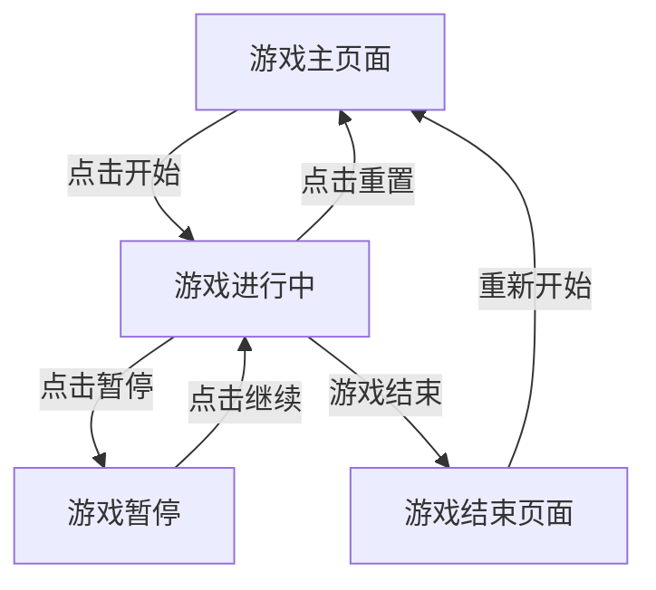

# 俄罗斯方块游戏产品需求文档

## 1. 产品概述
一款经典的俄罗斯方块网页游戏，提供流畅的游戏体验和完整的游戏功能。玩家通过控制下落的方块进行堆叠和消除，挑战高分记录。

目标用户：休闲游戏爱好者、怀旧玩家、各年龄段用户。

## 2. 核心功能

### 2.1 用户角色
| 角色 | 注册方式 | 核心权限 |
|------|----------|----------|
| 游客玩家 | 无需注册 | 直接开始游戏，本地保存最高分 |

### 2.2 功能模块
游戏包含以下核心页面：
1. **游戏主页面**：游戏区域、预览区、计分板、控制面板
2. **游戏结束页面**：最终得分、重新开始选项

### 2.3 页面详情

| 页面名称 | 模块名称 | 功能描述 |
|----------|----------|----------|
| 游戏主页面 | 主游戏区域 | 10列×20行标准网格，显示当前下落方块和已固定方块，使用Canvas渲染 |
| 游戏主页面 | 预览区域 | 显示下一个即将出现的方块形状，位于游戏区域右侧 |
| 游戏主页面 | 计分板 | 显示当前分数、已消除行数、当前等级，实时更新 |
| 游戏主页面 | 控制面板 | 包含开始、暂停、重置按钮，支持键盘快捷键 |
| 游戏主页面 | 操作说明 | 显示键盘控制说明（方向键移动/旋转，空格键快速下落） |
| 游戏结束页面 | 结果展示 | 显示最终得分、消除行数、最高等级，提供重新开始按钮 |

## 3. 核心流程

### 游戏流程
1. 玩家进入游戏页面，显示初始界面和操作说明
2. 点击"开始"按钮或按空格键开始游戏
3. 方块从顶部中央生成并自动下落
4. 玩家使用键盘控制方块移动、旋转和加速下落
5. 方块落地后固定，检查并消除完整行
6. 更新分数和等级，生成新方块继续游戏
7. 当方块堆叠到顶部时游戏结束，显示最终得分

### 页面导航流程图

## 4. 用户界面设计

### 4.1 设计风格
- **主色调**：深灰色背景(#1a1a2e)搭配霓虹色系方块
- **方块颜色**：
  - I方块：青色(#00f0f0)
  - J方块：蓝色(#0000f0)
  - L方块：橙色(#f0a000)
  - O方块：黄色(#f0f000)
  - S方块：绿色(#00f000)
  - T方块：紫色(#a000f0)
  - Z方块：红色(#f00000)
- **按钮样式**：圆角矩形，渐变色彩，悬停发光效果
- **字体**：无衬线字体，标题24px，正文16px，计分数字使用等宽字体
- **布局**：居中布局，游戏区域左侧，信息面板右侧
- **图标**：使用简洁的SVG图标表示控制按钮

### 4.2 页面设计概述

| 页面名称 | 模块名称 | UI元素 |
|----------|----------|--------|
| 游戏主页面 | 主游戏区域 | Canvas画布，尺寸300×600px（10×20格，每格30px），网格线深灰色(#2a2a4e)，边框2px白色发光效果 |
| 游戏主页面 | 预览区域 | 120×120px方块区域，显示下一个方块，带1px边框 |
| 游戏主页面 | 计分板 | 三行信息展示：分数（大号黄色数字）、行数（绿色）、等级（蓝色），背景半透明黑色 |
| 游戏主页面 | 控制面板 | 三个按钮：开始/暂停（绿色/橙色）、重置（红色），尺寸100×40px，圆角8px |
| 游戏主页面 | 操作说明 | 底部显示键盘控制：←→移动、↑旋转、↓加速、空格快速下落 |
| 游戏结束页面 | 结果展示 | 居中弹窗，显示"GAME OVER"、最终分数、消除行数，重新开始按钮 |

### 4.3 响应式设计
- **桌面优先**：默认适配1920×1080分辨率
- **平板适配**：宽度768-1024px时，游戏区域缩放至80%，按钮重新排列
- **手机适配**：宽度<768px时，游戏区域缩放至60%，添加虚拟方向键按钮
- **触摸优化**：移动端显示屏幕控制按钮，支持触摸操作

### 4.4 动画效果
- 方块下落：平滑动画，60fps
- 行消除：闪烁效果后消失，上方方块下落动画
- 游戏结束：屏幕渐红，方块震动效果
- 按钮交互：悬停放大1.05倍，点击缩小0.95倍
