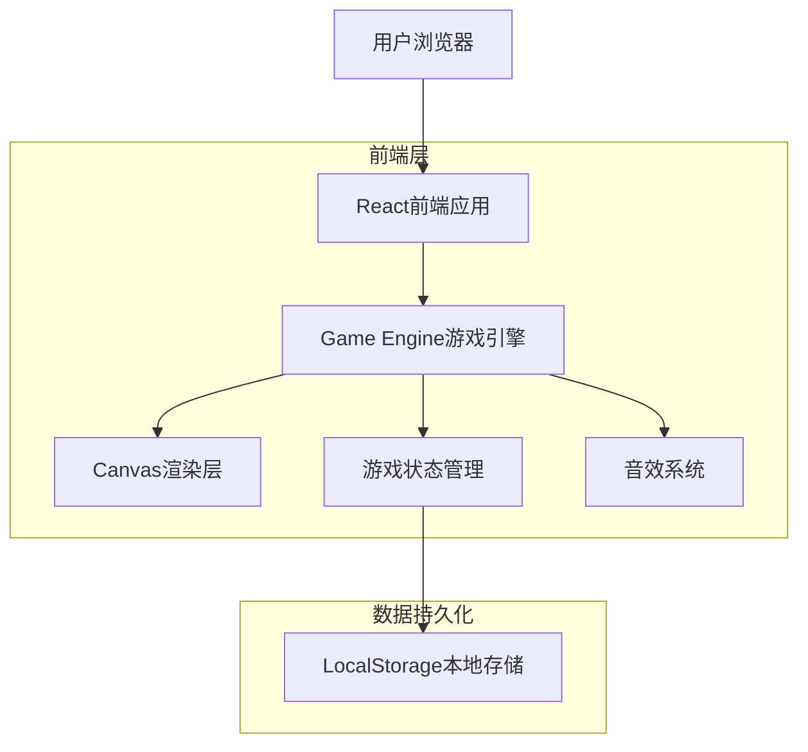

# 俄罗斯方块游戏技术架构文档

## 1. 架构设计



## 2. 技术描述

- **前端框架**: React@18 + TypeScript@5
- **样式方案**: TailwindCSS@3
- **构建工具**: Vite@5
- **Canvas渲染**: HTML5 Canvas API
- **状态管理**: React Hooks (useState, useReducer, useCallback)
- **音效系统**: Web Audio API
- **存储方案**: LocalStorage（保存最高分）
- **动画帧**: requestAnimationFrame

## 3. 路由定义

| 路由 | 用途 |
|------|------|
| / | 游戏主页面，包含完整游戏界面 |

## 4. 项目结构

```
src/
├── components/           # UI组件
│   ├── GameBoard.tsx    # 游戏主画布组件
│   ├── PreviewPanel.tsx # 预览区域组件
│   ├── ScoreBoard.tsx   # 计分板组件
│   ├── ControlPanel.tsx # 控制面板组件
│   └── GameOverModal.tsx # 游戏结束弹窗
├── hooks/               # 自定义Hooks
│   ├── useGameLoop.ts   # 游戏循环Hook
│   ├── useGameState.ts  # 游戏状态管理Hook
│   └── useAudio.ts      # 音效管理Hook
├── utils/               # 工具函数
│   ├── tetrominos.ts    # 方块定义与旋转逻辑
│   ├── collision.ts     # 碰撞检测
│   ├── scoring.ts       # 计分系统
│   └── constants.ts     # 游戏常量
├── types/               # TypeScript类型定义
│   └── game.ts          # 游戏相关类型
├── App.tsx              # 主应用组件
└── main.tsx             # 入口文件
```

## 5. 核心类型定义

```typescript
// 方块类型
export type TetrominoType = 'I' | 'J' | 'L' | 'O' | 'S' | 'T' | 'Z';

// 方块形状定义
export interface Tetromino {
  type: TetrominoType;
  shape: number[][];
  color: string;
  x: number;
  y: number;
}

// 游戏状态
export interface GameState {
  board: number[][];           // 10x20游戏板，0为空，其他为方块类型
  currentPiece: Tetromino | null;
  nextPiece: TetrominoType;
  score: number;
  lines: number;
  level: number;
  isPlaying: boolean;
  isPaused: boolean;
  isGameOver: boolean;
  dropInterval: number;        // 下落间隔（毫秒）
}

// 键盘控制
export enum GameAction {
  MOVE_LEFT = 'MOVE_LEFT',
  MOVE_RIGHT = 'MOVE_RIGHT',
  MOVE_DOWN = 'MOVE_DOWN',
  ROTATE = 'ROTATE',
  HARD_DROP = 'HARD_DROP',
  PAUSE = 'PAUSE',
  START = 'START',
  RESET = 'RESET'
}
```

## 6. 核心算法设计

### 6.1 方块旋转算法（SRS超级旋转系统简化版）

```typescript
// 顺时针旋转矩阵
function rotateClockwise(matrix: number[][]): number[][] {
  const N = matrix.length;
  const M = matrix[0].length;
  const rotated: number[][] = Array(M).fill(null).map(() => Array(N).fill(0));
  
  for (let i = 0; i < N; i++) {
    for (let j = 0; j < M; j++) {
      rotated[j][N - 1 - i] = matrix[i][j];
    }
  }
  return rotated;
}

// 逆时针旋转矩阵
function rotateCounterClockwise(matrix: number[][]): number[][] {
  const N = matrix.length;
  const M = matrix[0].length;
  const rotated: number[][] = Array(M).fill(null).map(() => Array(N).fill(0));
  
  for (let i = 0; i < N; i++) {
    for (let j = 0; j < M; j++) {
      rotated[M - 1 - j][i] = matrix[i][j];
    }
  }
  return rotated;
}

// 踢墙检测（Wall Kick）
function tryWallKick(
  piece: Tetromino, 
  newShape: number[][], 
  board: number[][]
): { x: number; y: number } | null {
  const kicks = [
    { x: 0, y: 0 },   // 原始位置
    { x: -1, y: 0 },  // 左移1格
    { x: 1, y: 0 },   // 右移1格
    { x: 0, y: -1 },  // 上移1格
    { x: -2, y: 0 },  // 左移2格（I方块）
    { x: 2, y: 0 },   // 右移2格（I方块）
  ];
  
  for (const kick of kicks) {
    const newX = piece.x + kick.x;
    const newY = piece.y + kick.y;
    if (!checkCollision(newShape, newX, newY, board)) {
      return kick;
    }
  }
  return null;
}
```

### 6.2 碰撞检测算法

```typescript
function checkCollision(
  shape: number[][], 
  x: number, 
  y: number, 
  board: number[][]
): boolean {
  for (let row = 0; row < shape.length; row++) {
    for (let col = 0; col < shape[row].length; col++) {
      if (shape[row][col] !== 0) {
        const newX = x + col;
        const newY = y + row;
        
        // 边界检测
        if (newX < 0 || newX >= BOARD_WIDTH || newY >= BOARD_HEIGHT) {
          return true;
        }
        
        // 方块堆叠检测（注意newY可能为负数，此时在顶部上方）
        if (newY >= 0 && board[newY][newX] !== 0) {
          return true;
        }
      }
    }
  }
  return false;
}
```

### 6.3 行消除算法

```typescript
function clearLines(board: number[][]): { newBoard: number[][]; linesCleared: number } {
  let linesCleared = 0;
  const newBoard: number[][] = [];
  
  // 从底部向上扫描
  for (let row = BOARD_HEIGHT - 1; row >= 0; row--) {
    // 检查该行是否已满
    const isFull = board[row].every(cell => cell !== 0);
    
    if (isFull) {
      linesCleared++;
    } else {
      newBoard.unshift([...board[row]]);
    }
  }
  
  // 在顶部添加新的空行
  while (newBoard.length < BOARD_HEIGHT) {
    newBoard.unshift(Array(BOARD_WIDTH).fill(0));
  }
  
  return { newBoard, linesCleared };
}
```

### 6.4 计分系统

```typescript
// 计分规则（根据消除行数和等级）
const SCORE_TABLE: Record<number, number> = {
  1: 100,   // 单行
  2: 300,   // 双行
  3: 500,   // 三行
  4: 800,   // 四行（Tetris）
};

function calculateScore(linesCleared: number, level: number): number {
  const baseScore = SCORE_TABLE[linesCleared] || 0;
  return baseScore * level;
}

// 等级与下落速度
function getDropInterval(level: number): number {
  // 等级越高，下落越快（毫秒）
  return Math.max(100, 1000 - (level - 1) * 100);
}
```

## 7. 游戏循环设计

```typescript
// 使用requestAnimationFrame实现60fps游戏循环
function gameLoop(timestamp: number) {
  if (!isPlaying || isPaused) return;
  
  const deltaTime = timestamp - lastDropTime;
  
  // 自动下落
  if (deltaTime > dropInterval) {
    movePieceDown();
    lastDropTime = timestamp;
  }
  
  // 渲染
  render();
  
  requestAnimationFrame(gameLoop);
}
```

## 8. 音效系统架构

```typescript
// 使用Web Audio API生成音效
class AudioManager {
  private audioContext: AudioContext;
  
  constructor() {
    this.audioContext = new (window.AudioContext || window.webkitAudioContext)();
  }
  
  // 生成移动音效（短促低音）
  playMoveSound() {
    this.playTone(200, 0.05, 'sine');
  }
  
  // 生成旋转音效（短促中音）
  playRotateSound() {
    this.playTone(400, 0.08, 'square');
  }
  
  // 生成消除音效（上升音阶）
  playClearSound(lines: number) {
    const baseFreq = 440;
    for (let i = 0; i < lines; i++) {
      setTimeout(() => {
        this.playTone(baseFreq + i * 110, 0.1, 'sine');
      }, i * 50);
    }
  }
  
  // 生成游戏结束音效（下降音阶）
  playGameOverSound() {
    const freqs = [440, 330, 220, 110];
    freqs.forEach((freq, i) => {
      setTimeout(() => this.playTone(freq, 0.2, 'sawtooth'), i * 150);
    });
  }
  
  private playTone(frequency: number, duration: number, type: OscillatorType) {
    const oscillator = this.audioContext.createOscillator();
    const gainNode = this.audioContext.createGain();
    
    oscillator.connect(gainNode);
    gainNode.connect(this.audioContext.destination);
    
    oscillator.frequency.value = frequency;
    oscillator.type = type;
    
    gainNode.gain.setValueAtTime(0.3, this.audioContext.currentTime);
    gainNode.gain.exponentialRampToValueAtTime(0.01, this.audioContext.currentTime + duration);
    
    oscillator.start(this.audioContext.currentTime);
    oscillator.stop(this.audioContext.currentTime + duration);
  }
}
```

## 9. 性能优化策略

1. **Canvas渲染优化**：使用双缓冲技术，仅重绘变化区域
2. **状态更新优化**：使用useMemo和useCallback减少不必要的重渲染
3. **键盘事件节流**：使用节流函数控制按键频率（防止长按过快）
4. **音效预加载**：使用AudioContext预生成常用音效
5. **移动端适配**：使用CSS transform进行缩放，保持Canvas分辨率
